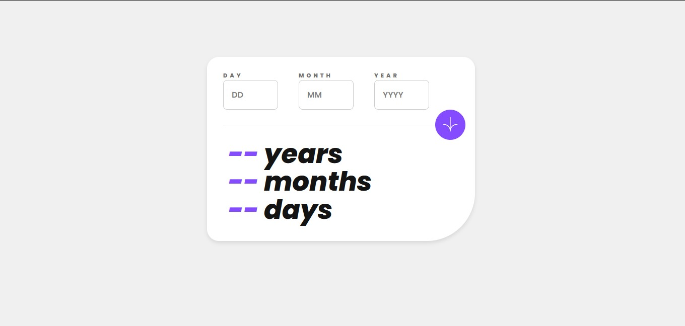

# Frontend Mentor - Age calculator app solution

This is a solution to the [Age calculator app challenge on Frontend Mentor](https://www.frontendmentor.io/challenges/age-calculator-app-dF9DFFpj-Q). Frontend Mentor challenges help you improve your coding skills by building realistic projects. 

## Table of contents

- [Overview](#overview)
  - [The challenge](#the-challenge)
  - [Screenshot](#screenshot)
  - [Links](#links)
- [My process](#my-process)
  - [Built with](#built-with)
  - [What I learned](#what-i-learned)
  - [Continued development](#continued-development)
  - [Useful resources](#useful-resources)
- [Author](#author)
- [Acknowledgments](#acknowledgments)

**Note: Delete this note and update the table of contents based on what sections you keep.**

## Overview

### The challenge

Users should be able to:

- View an age in years, months, and days after submitting a valid date through the form
- Receive validation errors if:
  - Any field is empty when the form is submitted
  - The day number is not between 1-31
  - The month number is not between 1-12
  - The year is in the future
  - The date is invalid e.g. 31/04/1991 (there are 30 days in April)
- View the optimal layout for the interface depending on their device's screen size
- See hover and focus states for all interactive elements on the page
- **Bonus**: See the age numbers animate to their final number when the form is submitted

### Screenshot

### Links

- Solution URL: [Add solution URL here](https://github.com/Ajaya-Rajbhandari/age-calculator-app)
- Live Site URL: [Add live site URL here](https://age-calculator-app-gamma-lovat.vercel.app)

## My process

### Built with

- Semantic HTML5 markup
- CSS custom properties
- Flexbox
- CSS Grid
- Mobile-first workflow
- [React](https://reactjs.org/) - JS library

### What I learned
During this project, I gained experience in:

- Implementing form validation in React
- Handling date calculations and manipulations
- Creating responsive layouts using CSS Grid and Flexbox
- Animating number changes for a more dynamic user experience
- Improving accessibility through semantic HTML and proper form validation feedback

### Continued development

In future projects, I plan to focus on:

- Enhancing my skills in React state management for more complex applications
- Exploring more advanced CSS animations and transitions
- Improving performance optimization techniques for React applications
- Implementing more robust error handling and user feedback mechanisms
- Diving deeper into accessibility best practices for web applications

### Useful resources

- [React Documentation](https://reactjs.org/docs/getting-started.html) - The official React documentation was invaluable for understanding React concepts and best practices.
- [MDN Web Docs](https://developer.mozilla.org/en-US/) - A great resource for HTML, CSS, and JavaScript references.
- [CSS-Tricks](https://css-tricks.com/) - Provided helpful articles on CSS Grid and Flexbox layouts.

## Author

- Website - [Ajaya Rajbhandari](https://ajaya-rajbhandari.vercel.app)
- Frontend Mentor - [@Ajaya-Rajbhandari](https://www.frontendmentor.io/profile/@Ajaya-Rajbhandari)
- Twitter - [@Ajaya521](https://www.twitter.com/@Ajaya521)

## Acknowledgments

